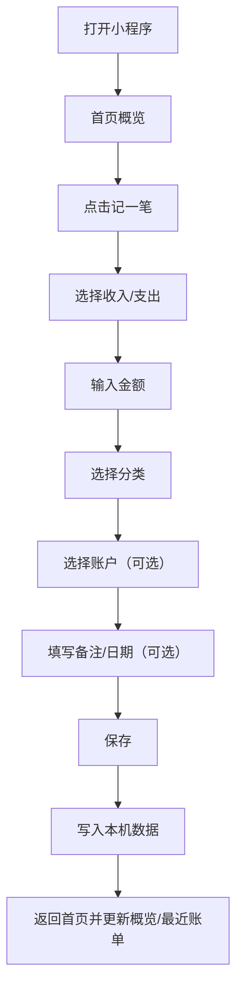
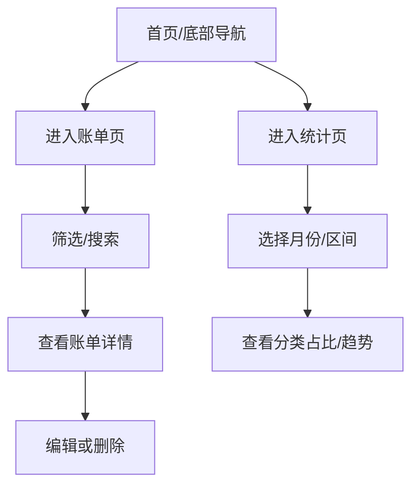

# UniApp 记账小程序 - 产品需求文档（PRD）

## 1. 产品概述

面向个人用户的轻量记账小程序，用最少步骤完成“记录一笔账”，并通过统计视图帮助用户了解收支结构与预算执行情况。

- 目标用户：学生/初入职场人群/希望随手记账的个人用户
- 核心价值：快、清晰、可回溯（按日历/分类/账户查看）

## 2. 核心功能

### 2.1 用户角色

| 角色 | 使用方式 | 核心权限 |
|------|----------|----------|
| 普通用户 | 直接使用（默认本机存储） | 记账、查账、统计、配置分类/账户/预算 |

### 2.2 功能模块

1. **首页（概览）**：本月结余、今日收支、快捷记账入口、最近账单
2. **记一笔**：收入/支出切换、金额键盘、分类选择、账户选择、日期、备注、可选标签
3. **账单（列表/明细）**：按日期分组、筛选（类型/分类/账户/关键词）、账单详情与编辑/删除
4. **统计（图表）**：按月/自定义区间、分类占比、趋势折线、Top 分类
5. **预算与资产**：月预算设置、分类预算（可选）、账户管理（现金/银行卡/余额宝等）、账户余额调整
6. **设置与数据**：分类管理、账户管理入口、数据导出（JSON/CSV）、数据备份/恢复（本机文件）

### 2.3 页面详情

| 页面名称 | 模块名称 | 功能描述 |
|---------|----------|----------|
| 首页 | 月度概览卡片 | 展示本月收入/支出/结余、预算剩余提示 |
| 首页 | 快捷操作 | “记一笔”主按钮；可选“转账/余额调整”入口 |
| 首页 | 最近账单 | 最近 N 条账单，点击进入详情 |
| 记一笔 | 金额键盘 | 自定义数字键盘：输入金额、删除、完成 |
| 记一笔 | 分类选择 | 支持常用分类置顶；支持搜索 |
| 记一笔 | 更多项 | 账户、日期、备注、标签（可选） |
| 账单 | 列表与分组 | 按天分组展示；支持下拉刷新/上拉加载（如有） |
| 账单 | 筛选与搜索 | 类型/分类/账户/时间范围/关键词筛选 |
| 账单详情 | 详情卡片 | 展示金额、分类、账户、时间、备注；支持编辑/删除 |
| 统计 | 分类占比 | 饼图/环形图展示支出/收入结构 |
| 统计 | 趋势 | 折线/柱状显示每日/每周趋势 |
| 预算与资产 | 预算设置 | 月预算、分类预算（可选）与超支提示策略 |
| 预算与资产 | 账户管理 | 新增/编辑/排序账户；余额调整与初始余额 |
| 设置与数据 | 分类管理 | 默认分类初始化；支持自定义、排序、停用 |
| 设置与数据 | 数据导出/备份 | 导出 JSON/CSV；本机备份与恢复，避免误删 |

## 3. 核心流程

### 3.1 记账流程（主链路）

用户打开小程序后，最快 2 步完成记账：点击“记一笔”→ 输入金额 → 选分类（若未默认）→ 保存。

### 3.2 查账与统计流程

## 4. 用户界面设计

### 4.1 设计风格

- 风格定位：轻量、清爽、信息密度适中，强调“金额”和“分类”
- 主题：浅色为主，支持深色模式（可选）
- 关键强调：收入（绿色系）、支出（红色系）、中性信息（灰蓝系）
- 排版：卡片化布局 + 底部导航；关键数值使用更大字号与等宽数字风格
- 交互：主按钮突出（“记一笔”）；输入金额使用自定义键盘提升效率

### 4.2 页面设计概览

| 页面名称 | 模块名称 | UI 元素 |
|---------|----------|---------|
| 首页 | 概览卡片 | 大数字、收入/支出对比、预算进度条、轻阴影卡片 |
| 记一笔 | 金额与分类 | 顶部金额大字、分类网格、常用分类置顶、主色按钮 |
| 账单 | 列表 | 日期分组标题、左右信息（分类/备注/账户）、金额右对齐 |
| 统计 | 图表区 | 环形图/柱状图、图例、筛选器（月份/区间） |
| 设置 | 列表项 | 二级页面入口、危险操作二次确认（删除/清空） |

### 4.3 适配与可用性

- 目标设备：手机为主（小程序场景），适配主流屏幕与安全区
- 触控：可点击区域不小于 44px；重要操作提供防误触确认
- 空状态：无账单/无分类/无账户时提供引导与一键初始化

