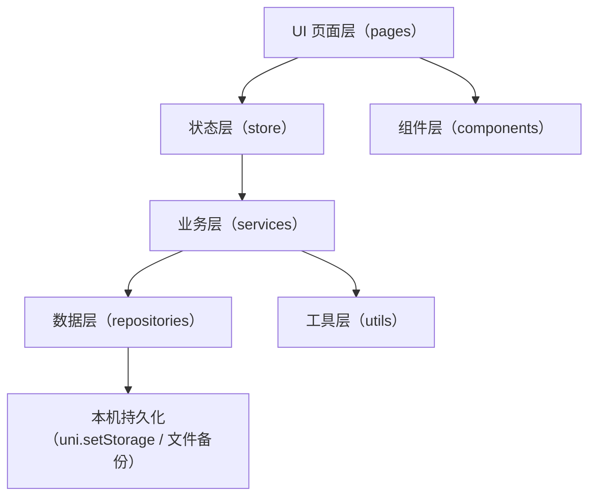
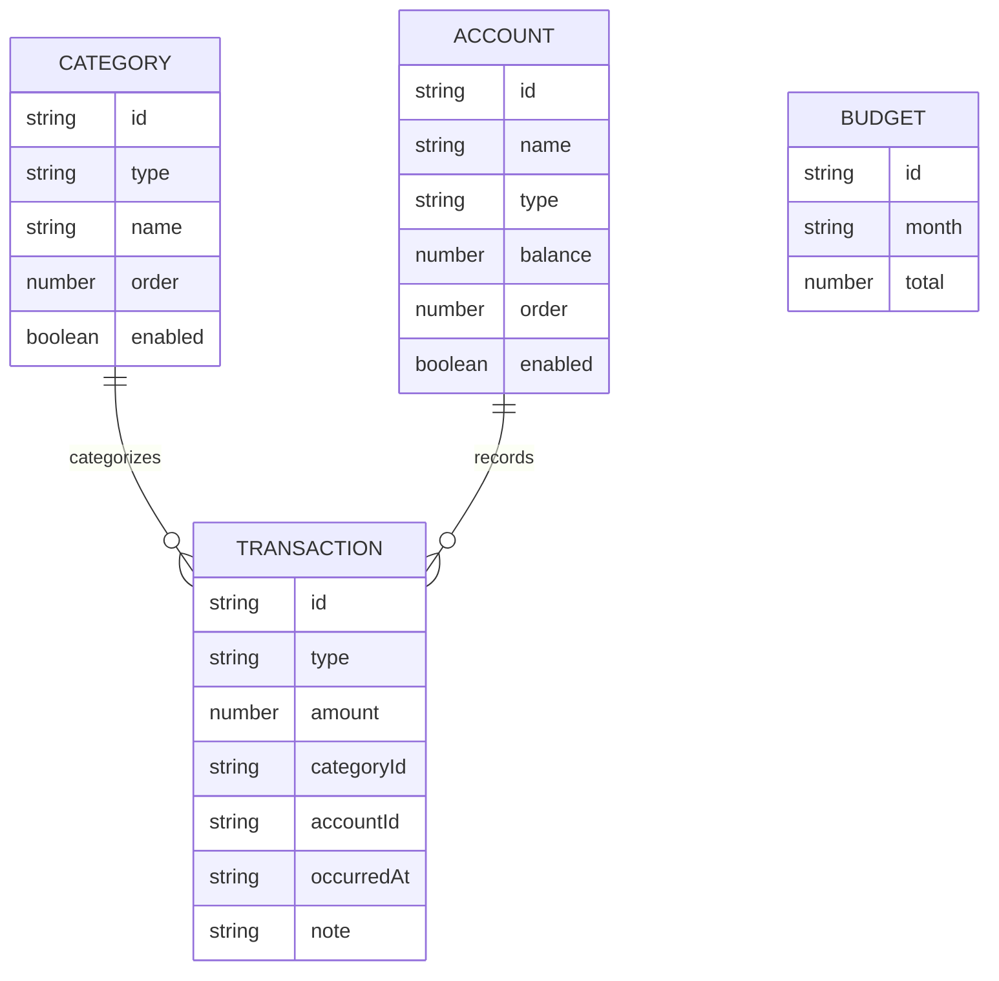

# UniApp 记账小程序 - 技术架构文档

## 1. 架构设计

采用“前端本地优先”的架构：核心数据与业务逻辑全部在小程序端完成，默认使用本机持久化存储；导出/备份用于数据迁移与防丢失。



## 2. 技术选型说明

- 前端框架：UniApp（建议 Vue 3）
- 语言：TypeScript（建议）
- 构建方式：HBuilderX 或 `@dcloudio/uni-cli`（根据开发习惯二选一）
- 状态管理：优先使用轻量 store（如 Pinia；若不引入则用自建 store + composables）
- 图表：优先使用轻量图表方案（若需引入第三方，选择体积小、兼容小程序的库）
- 数据持久化：`uni.setStorage` / `uni.getStorage`（必要时分片与版本迁移）

## 3. 路由与页面定义（pages.json）

| 路由 | 页面 | 用途 |
|------|------|------|
| /pages/home/index | 首页 | 概览、快捷记账、最近账单 |
| /pages/add/index | 记一笔 | 输入金额、选择分类/账户、保存 |
| /pages/bills/index | 账单 | 列表、筛选、搜索 |
| /pages/bill-detail/index | 账单详情 | 查看/编辑/删除 |
| /pages/stats/index | 统计 | 分类占比、趋势图 |
| /pages/assets/index | 预算与资产 | 预算设置、账户管理 |
| /pages/settings/index | 设置 | 分类管理、导出/备份、关于 |

## 4. 数据与 API 定义（本地业务接口）

### 4.1 核心类型（建议）

```ts
export type TxnType = 'expense' | 'income' | 'transfer'

export type Transaction = {
  id: string
  type: TxnType
  amount: number
  categoryId: string
  accountId: string
  occurredAt: string
  note?: string
  tags?: string[]
  createdAt: string
  updatedAt: string
}

export type Category = {
  id: string
  type: Exclude<TxnType, 'transfer'>
  name: string
  icon?: string
  color?: string
  order: number
  enabled: boolean
}

export type Account = {
  id: string
  name: string
  type: 'cash' | 'bank' | 'ecard' | 'other'
  balance: number
  order: number
  enabled: boolean
}

export type Budget = {
  id: string
  month: string
  total?: number
  byCategory?: Record<string, number>
}
```

### 4.2 业务服务（示例接口）

- `TransactionService`
  - `createTransaction(input)`
  - `updateTransaction(id, patch)`
  - `deleteTransaction(id)`
  - `listTransactions(query)`
- `StatsService`
  - `getMonthlySummary(month)`
  - `getCategoryBreakdown(range, type)`
  - `getTrend(range, granularity)`
- `BackupService`
  - `exportJSON() / exportCSV()`
  - `backupToFile() / restoreFromFile()`

## 5. 数据模型

### 5.1 ER 模型（逻辑）



### 5.2 本地存储结构（建议）

- `gp:version`：数据版本，用于迁移
- `gp:transactions`：`Transaction[]`
- `gp:categories`：`Category[]`
- `gp:accounts`：`Account[]`
- `gp:budgets`：`Budget[]`
- `gp:settings`：主题、默认账户、常用分类等

## 6. 目录结构建议

```
src/
  pages/
    home/
    add/
    bills/
    bill-detail/
    stats/
    assets/
    settings/
  components/
  services/
  repositories/
  store/
  utils/
  styles/
```

## 7. 关键实现策略

- ID 生成：前端生成 `id`（时间戳 + 随机串），确保离线可用
- 金额精度：使用“分”为单位保存（整数），展示时格式化，避免浮点误差
- 数据迁移：启动时检查 `gp:version`，必要时执行一次性迁移函数
- 性能：账单列表按日期分组；大列表按月分页或按区间加载
- 安全：不写入任何隐私/密钥；备份文件本地保存，恢复前做校验与二次确认

