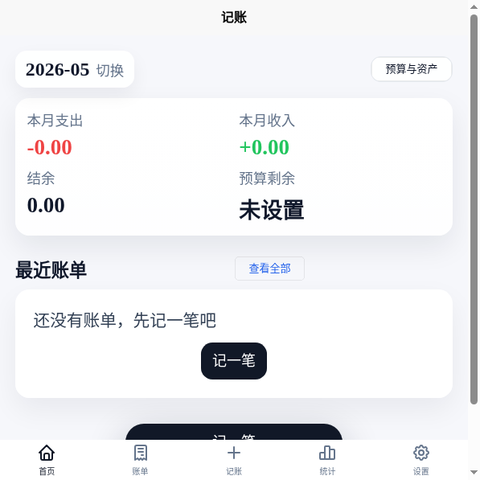
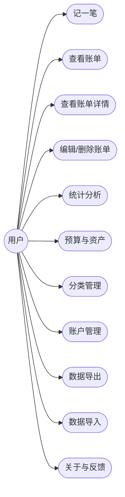
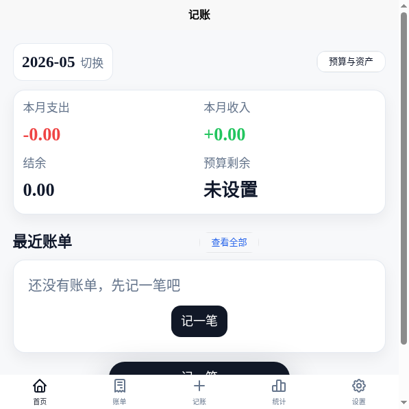
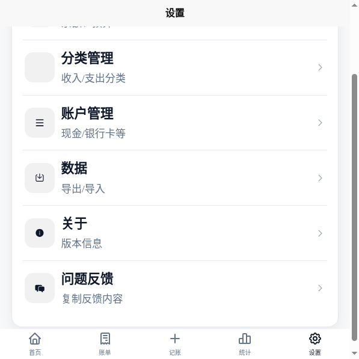
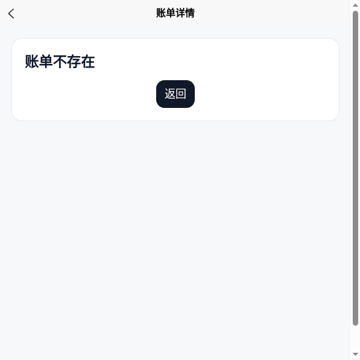
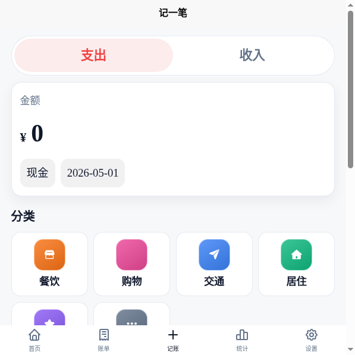
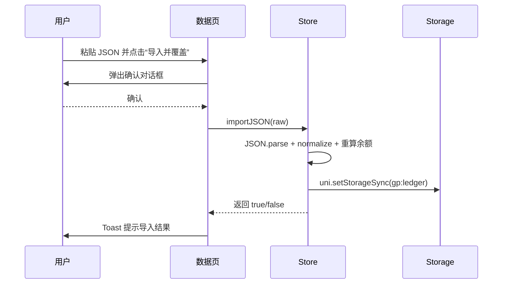

**毕业设计成果**

题 目：<span class="underline">基于 uni-app 的本地记账 App</span>

> <span class="underline">的设计与实现</span>

类 型： <span class="underline">产品设计</span>

学生姓名： <span class="underline">（填写）</span>

二级学院： <span class="underline">信息工程学院</span>

专 业： <span class="underline">移动互联应用技术</span>

班 级： <span class="underline">（填写）</span>

指导教师： <span class="underline">（填写）</span>

# 1 App 需求分析

## 1.1 App 产品定位与核心功能说明

### 1.1.1 产品定位

本项目是一款面向个人用户的“本地离线记账 App”。产品核心目标是：在不依赖后端服务的情况下，让用户完成日常收支记录、账单查询、统计分析、预算管理与数据备份，满足“随手记账、随时查看、可导出可恢复”的真实使用场景。

### 1.1.2 核心功能

核心功能包括：

1. 记一笔：支出/收入切换、金额输入、分类选择、账户选择、备注；
2. 账单管理：按月查看、按日期分组、搜索、详情、编辑、删除；
3. 统计分析：月度收支汇总、支出结构（环形图）、每日支出趋势；
4. 预算与资产：月预算设置、预算进度、账户余额与总资产；
5. 基础数据管理：分类管理、账户管理；
6. 数据备份：导出 JSON、导入覆盖；
7. 关于与反馈：版本信息、复制反馈内容。

### 1.1.3 整体功能用例图



图1-1 本地记账 App 整体功能用例图

## 1.2 App 产品各功能模块需求分析

本项目为离线记账工具，不涉及登录注册；主要功能模块按“记账—管理—分析—备份”进行拆分。

### 1.2.1 记一笔模块

#### 用例图


图1-2 记一笔模块用例图

#### 用例描述

表1-1 记一笔用例描述

<table>
<tbody>
<tr class="odd"><td>用例编号</td><td>UC1</td></tr>
<tr class="even"><td>用例名称</td><td>记一笔（新增账单）</td></tr>
<tr class="odd"><td>用例描述</td><td>用户在记一笔页面录入收支信息并保存，生成一条账单记录</td></tr>
<tr class="even"><td>参与者</td><td>用户</td></tr>
<tr class="odd"><td>前置条件</td><td>App 可正常运行；已存在至少一个启用的账户与分类</td></tr>
<tr class="even"><td>后置条件</td><td>账单写入本地存储；账户余额重新计算；首页/账单页列表更新</td></tr>
<tr class="odd">
<td>基本路径</td>
<td>
<p>1. 用户进入“记一笔”页面</p>
<p>2. 选择支出或收入类型</p>
<p>3. 输入金额</p>
<p>4. 选择分类与账户</p>
<p>5. 可选填写备注</p>
<p>6. 点击保存按钮</p>
<p>7. App 校验金额与字段合法性，保存到本地并提示“已保存”</p>
</td>
</tr>
</tbody>
</table>

### 1.2.2 账单管理模块

需求点：

1. 按月查看账单，按日期分组展示；
2. 支持按关键词搜索（备注/分类）；
3. 点击账单进入详情页；
4. 在详情页支持编辑与删除（删除二次确认）。

### 1.2.3 统计分析模块

需求点：

1. 月度收支汇总（收入、支出、结余）；
2. 支出结构：按分类汇总，显示环形图与前 N 分类占比；
3. 每日支出：按日期显示条形趋势（相对大小）。

### 1.2.4 预算与资产模块

需求点：

1. 按月设置预算金额，支持清除预算；
2. 预算进度条显示已用/剩余；
3. 展示各账户余额与总资产。

### 1.2.5 分类与账户管理模块

需求点：

1. 分类管理：新增分类（名称、图标 type、颜色），可启用/停用；
2. 账户管理：新增账户（名称、类型），可启用/停用；
3. 分类/账户的启用状态影响记账可选项。

### 1.2.6 数据导入导出模块

需求点：

1. 导出：一键生成 JSON 字符串并复制到剪贴板；
2. 导入：粘贴 JSON，二次确认后覆盖本机数据；
3. 导入失败要提示；导入成功后刷新导出区内容。

# 2 App 设计

## 2.1 App 产品 UI 设计

### 2.1.1 设计工具与规范

1. 设计工具：原型可使用 Figma / 即时设计 / Axure（本项目实现界面以代码效果为准）；
2. 设计规范：
   - 信息层级：标题 > 数值 > 辅助信息；
   - 颜色：主色深灰（强调操作）、辅助灰（描述文本），收支颜色（支出红、收入绿）；
   - 圆角与阴影：统一圆角与轻阴影，突出卡片层级但保持简洁；
   - 导航：底部 TabBar（首页/账单/记账/统计/设置），二级页面使用返回导航。

### 2.1.2 关键页面示例



图2-1 首页界面示例图



图2-2 设置界面示例图



图2-3 账单详情界面示例图



图2-4 分类图标与分类选择示例图

## 2.2 App 数据来源

本项目数据来源为“用户本地输入 + 本地存储”，不依赖第三方 API 或自建服务器。

1. 用户输入数据：
   - 账单（金额、分类、账户、日期、备注等）；
   - 分类与账户配置；
   - 月预算设置。
2. 数据持久化存储：
   - 使用 `uni.setStorageSync` 将完整业务数据对象序列化为 JSON 保存到本地；
   - 关键存储键：`gp:ledger`；
   - 导入/导出通过 JSON 字符串复制/粘贴完成。

# 3 App 功能界面展示及代码实现

说明：本章仅展示核心代码（不截图代码），并配套文字说明。

## 3.1 数据模型与本地存储实现

### 3.1.1 数据模型

核心数据结构包括：Transaction（账单）、Category（分类）、Account（账户）、Budget（预算）、LedgerData（聚合数据）。

代码位置：[types.ts](file:///workspace/projects/01-uniapp-ledger/src/domain/types.ts)

```ts
export type Transaction = {
  id: string
  type: "expense" | "income" | "transfer"
  amountCents: number
  categoryId: string
  accountId: string
  occurredAt: string
  note?: string
  createdAt: string
  updatedAt: string
}
```

【代码说明】

1. `amountCents` 以“分”为单位避免浮点误差；
2. `occurredAt/createdAt/updatedAt` 使用 ISO 时间字符串便于排序与跨端序列化；
3. `categoryId/accountId` 通过关联 ID 与分类/账户进行绑定。

### 3.1.2 本地持久化与迁移

代码位置：[ledgerStorage.ts](file:///workspace/projects/01-uniapp-ledger/src/repositories/ledgerStorage.ts)

```ts
const STORAGE_KEY = "gp:ledger"

export function loadLedgerData(): LedgerData {
  try {
    const raw = uni.getStorageSync(STORAGE_KEY)
    if (!raw) return createEmptyLedgerData()
    const parsed = typeof raw === "string" ? (JSON.parse(raw) as LedgerData) : (raw as LedgerData)
    return migrate(parsed)
  } catch {
    return createEmptyLedgerData()
  }
}

export function saveLedgerData(data: LedgerData) {
  const payload: LedgerData = { ...data, version: LEDGER_DATA_VERSION }
  uni.setStorageSync(STORAGE_KEY, JSON.stringify(payload))
}
```

【代码说明】

1. `loadLedgerData` 从 Storage 中读取 JSON 并做容错处理；
2. `migrate` 负责数据版本迁移与字段修正（如非法金额、图标字段兼容等）；
3. `saveLedgerData` 统一写入，并写入 `version` 方便未来升级。

## 3.2 记一笔（新增/编辑账单）实现

核心逻辑在 Store 中完成，页面负责收集输入并调用 Store 方法。

代码位置：[useLedgerStore.ts](file:///workspace/projects/01-uniapp-ledger/src/store/useLedgerStore.ts#L90-L128)

```ts
function createTransaction(input: CreateTxnInput) {
  if (!isValidCents(input.amountCents) || input.amountCents <= 0) return ""
  const now = new Date().toISOString()
  const txn: Transaction = {
    id: createId("txn"),
    createdAt: now,
    updatedAt: now,
    ...input,
    amountCents: Math.min(input.amountCents, MAX_ABS_CENTS),
    occurredAt: normalizeOccurredAt(input.occurredAt),
  }
  state.data.transactions.unshift(txn)
  normalize()
  recalcAccountBalances()
  persist()
  return txn.id
}
```

【代码说明】

1. 创建账单前对金额合法性做校验；
2. 账单插入数组头部，保证最近账单优先显示；
3. 写入后进行排序与账户余额重算，最后持久化到本地。

## 3.3 账单详情、编辑与删除实现

账单详情页根据 `id` 查询账单并展示，删除操作进行确认。

代码位置：[bill-detail/index.vue](file:///workspace/projects/01-uniapp-ledger/src/pages/bill-detail/index.vue)

关键点：

1. 支持从 `onLoad` 参数与浏览器地址栏中兜底解析 `id`，避免 H5 直链打开导致“账单不存在”；
2. 删除前弹窗确认，删除后返回上一页并提示结果。

## 3.4 统计分析实现

统计页按月聚合交易数据：

1. 收支汇总：对当月交易按 type 求和；
2. 支出结构：按分类聚合并计算占比；
3. 每日支出：按日期聚合并映射为条形宽度。

代码位置：[stats/index.vue](file:///workspace/projects/01-uniapp-ledger/src/pages/stats/index.vue)

环形图绘制使用 Canvas：

代码位置：[DonutChart.vue](file:///workspace/projects/01-uniapp-ledger/src/components/DonutChart.vue)

## 3.5 数据导入导出实现

导出：将完整 `LedgerData` 序列化为 JSON 并复制；

导入：粘贴 JSON，二次确认后覆盖本地数据，并触发数据规范化与账户重算。

代码位置：[data/index.vue](file:///workspace/projects/01-uniapp-ledger/src/pages/data/index.vue)

### 时序图（导入覆盖）



图3-1 数据导入覆盖时序图

# 4 App 测试

## 4.1 测试方案

本项目以功能测试为主，覆盖关键业务链路与异常场景。主要测试场景包括：

1. 记一笔：输入校验、保存成功、列表刷新；
2. 账单：按月分组、搜索、进入详情；
3. 账单详情：显示正确、编辑、删除确认；
4. 统计：当月无数据/有数据、图表渲染；
5. 预算与资产：预算设置、清除、进度计算；
6. 分类/账户：新增、启用/停用；
7. 导入导出：导出复制、导入校验、覆盖提示。

## 4.2 测试用例

表4-1 记一笔模块测试用例

<table>
<tbody>
<tr class="odd">
<td><h2 id="用例编号">用例编号</h2></td>
<td><h2 id="用例描述">用例描述</h2></td>
<td><h2 id="前置条件">前置条件</h2></td>
<td><h2 id="操作步骤">操作步骤</h2></td>
<td><h2 id="预期结果">预期结果</h2></td>
<td><h2 id="测试结果">测试结果</h2></td>
</tr>
<tr class="even">
<td><h2 id="section">1.1</h2></td>
<td>新增支出账单</td>
<td>存在启用的账户与分类</td>
<td>进入记一笔→选择支出→输入金额→选择分类与账户→保存</td>
<td>保存成功并提示；首页/账单列表出现新记录</td>
<td>测试通过</td>
</tr>
<tr class="odd">
<td><h2 id="section-1">1.2</h2></td>
<td>金额为空不允许保存</td>
<td>进入记一笔页面</td>
<td>不输入金额→点击保存</td>
<td>提示输入金额或保存失败；不产生新账单</td>
<td>测试通过</td>
</tr>
<tr class="even">
<td><h2 id="section-2">1.3</h2></td>
<td>新增收入账单</td>
<td>存在启用的账户与分类</td>
<td>进入记一笔→切换收入→输入金额→保存</td>
<td>保存成功；统计页收入增加</td>
<td>测试通过</td>
</tr>
</tbody>
</table>

表4-2 数据导入导出测试用例

<table>
<tbody>
<tr class="odd">
<td><h2 id="用例编号-1">用例编号</h2></td>
<td><h2 id="用例描述-1">用例描述</h2></td>
<td><h2 id="前置条件-1">前置条件</h2></td>
<td><h2 id="操作步骤-1">操作步骤</h2></td>
<td><h2 id="预期结果-1">预期结果</h2></td>
<td><h2 id="测试结果-1">测试结果</h2></td>
</tr>
<tr class="even">
<td><h2 id="section-3">2.1</h2></td>
<td>导出并复制 JSON</td>
<td>本地存在账单数据</td>
<td>进入数据页→点击复制</td>
<td>剪贴板写入 JSON；提示“已复制”</td>
<td>测试通过</td>
</tr>
<tr class="odd">
<td><h2 id="section-4">2.2</h2></td>
<td>导入非法 JSON</td>
<td>进入数据页</td>
<td>粘贴非 JSON 文本→导入并覆盖→确认</td>
<td>提示“导入失败”；原数据不被覆盖</td>
<td>测试通过</td>
</tr>
<tr class="even">
<td><h2 id="section-5">2.3</h2></td>
<td>导入合法 JSON 覆盖数据</td>
<td>已准备合法导出文本</td>
<td>粘贴 JSON→导入并覆盖→确认</td>
<td>提示“导入成功”；首页与账单列表刷新为导入数据</td>
<td>测试通过</td>
</tr>
</tbody>
</table>

## 4.3 测试结论

通过对核心功能模块的测试，系统能够稳定完成记账、账单管理、统计分析、预算设置与数据导入导出等主要功能。对异常输入（如非法 JSON、无效金额）具备基本防护与提示能力，满足本地离线记账工具的使用需求。

# 结论

本次毕业设计完成了一款基于 uni-app（Vue3）的本地离线记账 App，实现了从数据模型、持久化存储、业务逻辑到 UI 展示的完整闭环。项目在实现过程中重点处理了金额精度、数据校验、数据迁移与跨端跳转兼容等问题，并在此基础上完成了统计图表与数据备份能力。

后续可扩展方向包括：账单标签体系、按分类预算、账单导出为文件（CSV/Excel）、云同步与多设备一致性等。

# 参考文献

[1] 李书明, 万然, 崔童谣, 等. 基于 uni-app 框架的一部手机管生产 APP 的开发和应用[J]. 现代信息科技, 2023, 7(15):35-38.

[2] 杨栋栋, 高凯, 赵骏祺, 等. 基于 uni-app 的康养之家 App 的设计与实现[J]. 电脑知识与技术, 2023, 19(12):48-50+70.

[3] uni-app 官方文档. https://uniapp.dcloud.io/ （访问日期：2026-05-01）

[4] Vue 3 官方文档. https://cn.vuejs.org/ （访问日期：2026-05-01）

