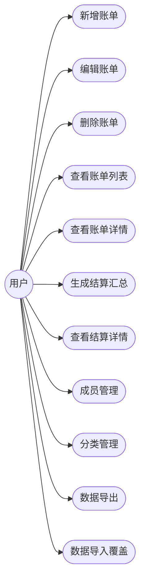
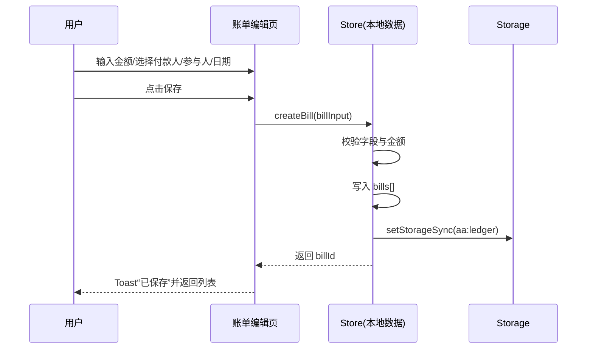
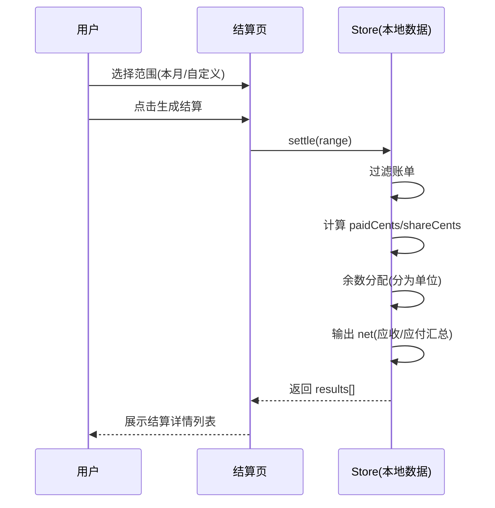

**宿舍AA分摊助手（纯本地）用例与时序图**

# 1 用例图

## 1.1 整体用例图

图1-1 宿舍AA分摊助手整体用例图

## 1.2 新增账单用例图

图1-2 新增账单用例图

## 1.3 生成结算汇总用例图

图1-3 生成结算汇总用例图

# 2 时序图

## 2.1 新增账单时序图

图2-1 新增账单时序图

## 2.2 生成结算汇总时序图（平均分摊）

图2-2 生成结算汇总时序图

